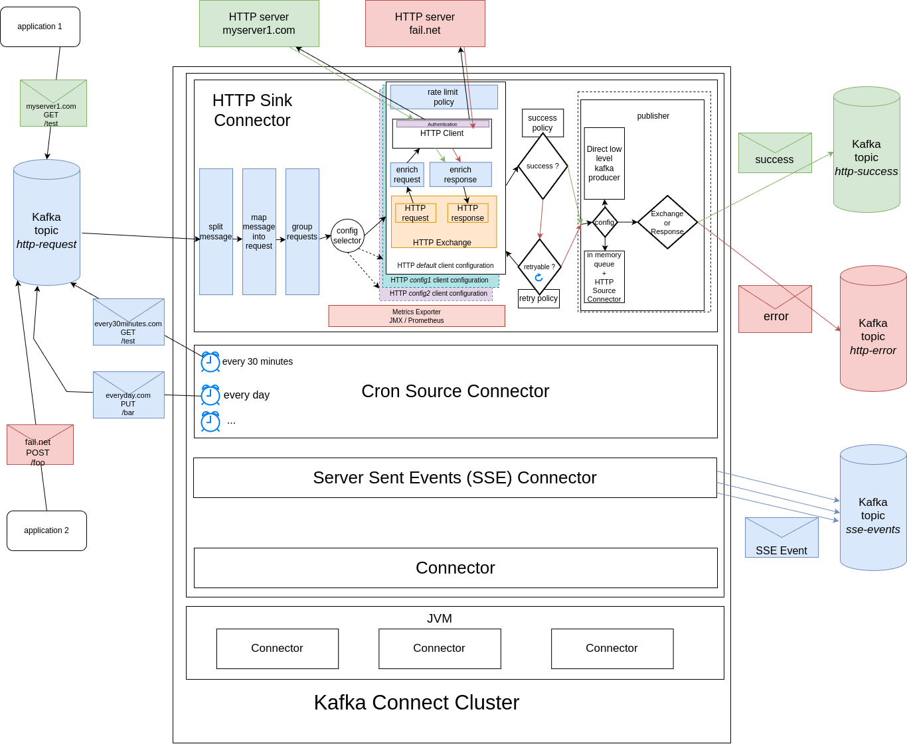

# Kafka Connect HTTP Sink, HTTP Source, Cron Source and Server-Sent Events (SSE) Client connectors project

# 1. [Quick Start Guide](docs/quick_start.md)
# 2. [Project Intention](docs/project_intention.md)
# 3.[Architecture](docs/architecture.md)
# 4. [how to install](docs/install.md)
# 5. [HTTP Sink connector settings](docs/http_sink_connector_settings.md)
# 6. [HTTP Source connector settings (optional)](docs/http_source_connector_settings.md)
# 7. [Cron Source connector settings (optional)](docs/cron_source_connector_settings.md)
# 8. [Server Sent Events (SSE) Source connector settings (optional)](docs/sse_source_connector_settings.md)
# 9. [incoming message format](docs/incoming_message_format.md)
# 10. [request handling](docs/request_handling.md)
# 11. [outcoming message format](docs/outcoming_message_format.md)
# 12. [scalability](docs/scalability.md)

