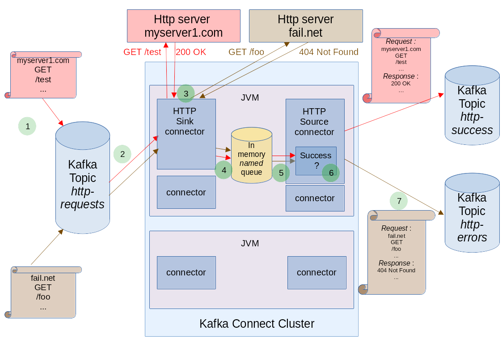

# Kafka Connect HTTP Sink project

## 1. project intention

### What is the goal of this project?

The main goal of this project is to allow to interact with HTTP servers, with a [Kafka Connect](https://docs.confluent.io/platform/current/connect/index.html)
cluster.
It permits to define HTTP requests, and store optionnally HTTP responses as Kafka messages, with Kafka connect connectors.

### Advantages of this project

It permits to query finely HTTP servers and store their responses with the High level Kafka Connect configuration.

Other Kafka Connect Connectors permits to interact with HTTP servers.

But they have got some restrictions :

- some projects ignore HTTP responses
- some projects which don't ignore HTTP responses, mix a high level Kafka Connect configuration to query, with a low level configuration to store HTTP responses. 
- some projects have got a proprietary licence


### What is the problem with Kafka Connect and HTTP ? 

Kafka connect permits to copy data from/to a Kafka Cluster easily, but not to interact (request/response) with an external ressource.

Kafka Connect divide tasks between Sink and
Source connectors :

- **Sink** connectors get data from Kafka and output to an external data target
- **Source** Connectors get data from an external data source and output it to Kafka 

The main advantage of this separation is to ease data interactions.

The main problem with HTTP interactions, is its request/response nature.

#### How does it NOT work ?

- *the One connector strategy*

    If you define only one connector, you can read a kafka message (with the reusable high level Kafka connect configuration), and query an HTTP server. If you want to store HTTP responses, 
    you need to define a low level kafka client which will translate HTTP responses as kafka messages : you duplicate the Kafka configuration, with some low level and high level configurations mixed.
    Your configuration can became complex...
    This strategy can work if you don't bother with HTTP responses (but who don't ?), and don't configure a low level kafka client.

- *Multiple connectors to solve the problem ?*
    
    Sink and Source connectors share interactions with the Kafka Cluster. You can easily, out of the box, define a *Source* Connector 
  which will listen to an external Datasource, and store data into Kafka. You can also define a *Sink* Connector which 
  will listen to Kafka, and output data to a target. But  it reverses HTTP interactions ; we don't receive HTTP reponses 
  before querying an HTTP server ; we cannot declare a *Source* Connector, which will chain through Kafka with a *Sink* Connector : 
- this is not a solution to our problem.

### How does it work? How do we solve the problem ?
    
    We need to revert the multiple connectors proposal in the previous section, with a shared channel different from Kafka
- a **Sink** Connector to query HTTP servers

    We define a Sink Connector to read from kafka, and query HTTP servers according to the Kafka message. This is the most easy part.
- an optional **Source** Connector to store HTTP responses
 
  If we need to store HTTP responses, the **Sink** Connector need to publish to the **Source** Connector the responses. 
  We use **an internal unbounded in memory Thread-safe Queue** for this purpose. Global HTTP interactions are (request,responses,
  and metadatas) published in the in memory queue.

### Does it cancel the distributed nature of Kafka Connect ?

No, you can distribute http queries between multiple Kafka Connect instances. The local nature is only for the correlation between
HTTP query and HTTP responses.

### Does the unbounded in memory queue implies an *OutOfMemoryError* risk ?

As both ends of the in memory queue, implies a Kafka communication, the *OutOfMemory* risk seems mitigated by the same source of problem on both sides (kafka communication problem).
We also check that all queues registered has got their consumer (Source Connector instance).
Note that a queue has got only one consumer, opposite to the Topic concept, which support multiple consumers. The only one queue consumer, is the configured Source Connector.

# 2. Architecture



This big picture permits to highlight (with numbers in the picture) some key points in the architecture, which will be explained with details
after the section dedicated to put in place the HTTP Sink and Source connectors:

1. format of the incoming Kafka message (HTTP intention)
2. The HTTP Sink connector listen to these topics (can be a list of topics, or a regex)
3. The HTTP Sink connector transform the incoming message into an HTTP call and get the answer from the HTTP server
  Behaviour of the HTTP client shipped with the HTTP Sink Connector can be tuned, including the retry policy. 
4. Optionally (`publish.to.in.memory.queue` set to `true` in the HTTP Sink Connector configuration), the HTTP exchange 
   is published into a `default` in memory queue (or a defined queue with the `queue.name` parameter in the HTTP Sink  
   Connector configuration). A check is done to prevent publishment to a 'in memory' queue without consumer(Source Connector),  
   i.e preventing an OutofMemory Error. The HTTP Sink Connector will fail at the first message consumption in this situation.   
5. If configured in the Sink Configuration, an HTTP Source Connector is needed to consume the published 
   HTTP exchange(with all the details of the interaction).
6. According to the HTTP Exchange details, 

# 3. HTTP Connectors configuration

Here are the configuration to setup an HTTP Sink connector, and optionally an HTTP Source Connector, into a Kafka Connect
 cluster. Note that the jar file owning these connector classes, 
[need to be installed with the Kafka connect runtime](https://docs.confluent.io/kafka-connectors/self-managed/install.html#install-connector-manually). 

### HTTP Sink Connector

#### required parameters

every Kafka Connect Sink Connector need to define these required parameters :

- *connector.class* : `com.github.clescot.kafka.connect.http.sink.WsSinkConnector`
- *topics* (or *topics.regex*): `http-requests` for example

#### optional Kafka Connect parameters

- *tasks.max*  (default to `1`)
- *key.converter*
- *value.converter*
- ....

#### optional HTTP Sink connector parameters

- *publish.to.in.memory.queue* : `false` by default. When set to `true`, publish HTTP interactions (request and responses)
 are published into the in memory queue. 
- *queue.name* : if not set, `default` queue name is used, if the `publish.to.in.memory.queue` is set to `true`. 
  You can define multiple in memory queues, to permit to publish to different topics, different HTTP interactions. If
 you set this parameter to a value different than `default`, you need to configure an HTTP source Connector listening 
 on the same queue name to avoid some OutOfMemoryErrors.
- *static.request.header.names* : list of headers names to attach to all requests. *Static* term, means that these headers 
 are not managed by initial kafka message, but are defined at the connector level and added globally. this list is divided by 
 `,` character. The connector will try to get the value to add to request by querying the config with the header name as parameter name.
 For example, if set `static.request.header.names: param_name1,param_name2`, the connector will lookup the param_name1 
  and param_name2 parameters to get values to add. 

#### Configuration example

`sink.json` example :
```json 
{
    "name": "my-http-sink-connector",
    "config": {
    "connector.class":"com.github.clescot.kafka.connect.http.sink.WsSinkConnector",
    "tasks.max": "1",
    "topics":"http-request",
    }
}
```

You can create or update this connector instance with this command :

```bash
curl -X PUT -H "Content-Type: application/json" --data @sink.json http://my-kafka-connect-cluster:8083/connectors/my-http-sink-connector/config
```
### HTTP Source Connector

The HTTP Source connector is only useful if you have configured the publishment of HTTP interactions into the queue, 
via the `publish.to.in.memory.queue` set to `true`.

#### required HTTP Source connector parameters

- *success.topic* : Topic to receive successful http request/responses, for example, http-success
- *error.topic* : Topic to receive errors from http request/responses, for example, http-error

#### optional HTTP Source connector parameters

- *queue.name* : if not set, listen on the 'default' queue.

#### Configuration example


`source.json` example :
```json 
{
    "name": "my-http-source-connector",
    "config": {
    "connector.class":"com.github.clescot.kafka.connect.http.source.WsSourceConnector",
    "tasks.max": "1",
    "success.topic": "http-success",
    "error.topic": "http-error",
    }
}
```

You can create or update this connector instance with this command :

```bash
curl -X PUT -H "Content-Type: application/json" --data @source.json http://my-kafka-connect-cluster:8083/connectors/my-http-source-connector/config
```

