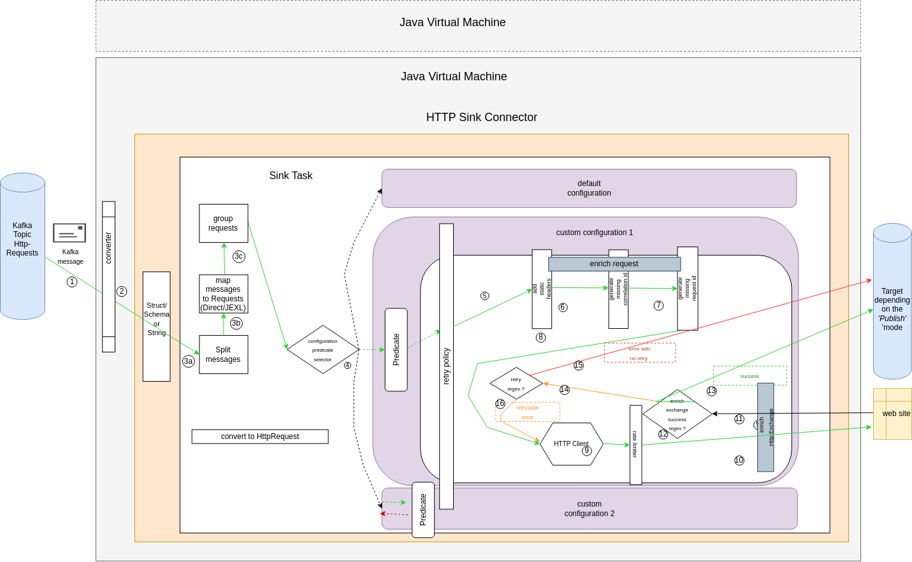

# Http Sink Connector detailed Architecture

1. The HTTP Sink connector listen to the incoming HttpRequest topics (can be a list of topics, or a regex, via *topics* or *topics.regex* settings)
2. a converter convert the byte array either as a string, or from a binary format described in a schema (Avro, JSON Schema or Protobuf)  to a Struct
3. a sink task which get multiple records each time, convert the record (String or Struct) into an HttpRequest object, with a matching HttpRequestMapper.
4. the sink task select the right configuration according to the predicate bound to it (the HttpRequest is tested against the predicate).
5. if configured, the configuration add some additional static headers.
6. if configured, the configuration add a correlation id if not found.
7. if configured, the configuration add a request id if not found.
8. a request is asked to the HTTP client
9. a throttling via the rate limiter is applied
10. the request is executed against the web site
11. the response is received, and the HttpExchange is built and enriched with a status (based on the `config.<idconfig>.enrich.exchange.success.response.code.regex`)
12. a decision is made against the HttpExchange status build in the previous stage
13. if the HttpExchange status is a success, the HttpExchange is serialized into the in memory queue
14. if the HttpExchange status is not a success, an evaluation is done to know if the error is retryable (based on the `config.<idconfig>.retry.policy.response.code.regex`)
15. if the error is not retryable, or the retry attempts limit is reached, the failing HttpExchange is serialized into the in memory queue.
16. if the error is retryable, another HTTP call is done.