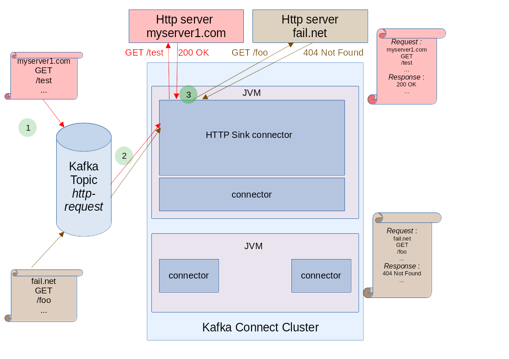
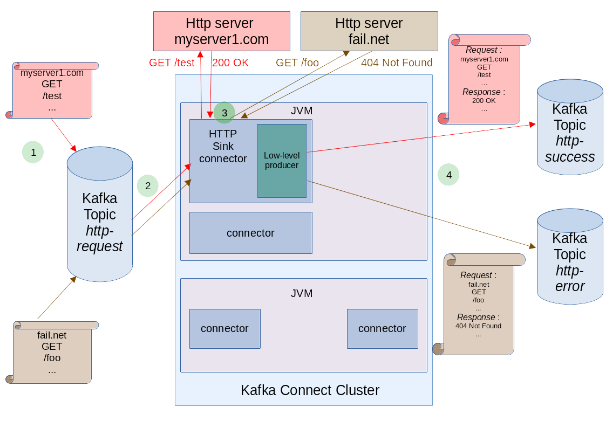
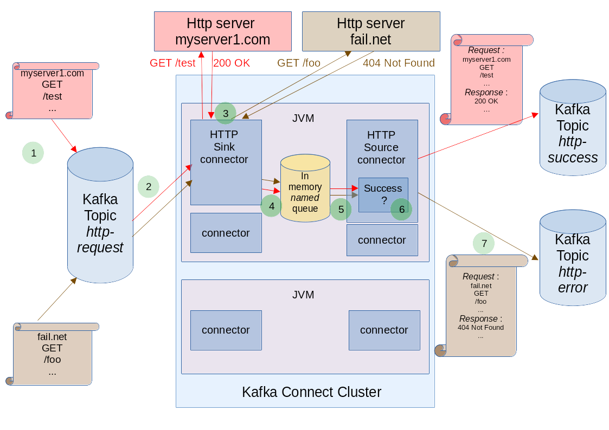

# project intention

## What is the goal of this project?

The main goal of this project is to allow to interact with HTTP servers, via a [Kafka Connect](https://docs.confluent.io/platform/current/connect/index.html)
cluster.
It permits to execute HTTP requests, and store optionally HTTP responses as Kafka messages.

## Advantages of this project

It permits to query finely asynchronously HTTP servers and store their responses with with multiple deployment options.

Other Kafka Connect Connectors permits to interact with HTTP servers.

But they have got some restrictions :

- some projects ignore HTTP responses
- some projects which don't ignore HTTP responses, only propose one configuration (which mix a high level Kafka Connect  to query, with a low level configuration to store HTTP responses).
 it can satisfy some needs, but not all of them, in case of complex connection configuration of the kafka connect, which can be hard to replicate in the connector configuration 
  (for example, in case of using some third-party libraries related to oauth2 authentication to the kafka cluster, with related classloader issues).  
- some projects have got a proprietary licence

## What is the problem with Kafka Connect and HTTP ?

Kafka connect permits to copy data from/to a Kafka Cluster easily, but not to interact (request/response) with an external resource.

Kafka Connect divide tasks between Sink and
Source connectors :

- **Sink** connectors get data from Kafka and output to an external data target
- **Source** Connectors get data from an external data source and output it to Kafka

The main advantage of this separation is to ease data interactions.

Kafka Connect connectors are "one way connectors", but the main problem with HTTP interactions, is its request/response nature (two-way interaction, a request and a response).

## How do we solve the problem ? How does it work?

You can solve the 'publish' challenge in 4 different modes (each one has got some drawbacks) :

 - the `NONE` mode
    - advantages :
      - simplicity !
      - you configure only one connector
      - you have no locality restrictions
      - your configuration is easy
      - you don't mix different informations in the same topic
    - drawbacks :
      - you ignore the HTTP responses

 - the `DLQ` mode
   - advantages :
     - you configure only one connector
     - you have no locality restrictions
     - your configuration is easy
     - you get the HTTP responses
   - drawbacks :
     - you mix in the same error topic, the HTTP responses with some potential real errors (of this connector).

- the `PRODUCER` mode
  - advantages :
    - you configure only one connector
    - you have no locality restrictions
    - you get the HTTP responses
    - you don't mix different informations in the same topic
  - drawbacks :
    - your configuration is more complex : you duplicate some connection configuration, which can be challenging in some cases :
      - at the _kafka connect cluster_ level
      - at the _connector_ level

- the `IN_MEMORY_QUEUE` mode 

  We use multiple connectors, with a shared channel different from Kafka. We provide :

  - a **Sink** Connector to query HTTP servers

    We define a Sink Connector to read from kafka, and query HTTP servers according to the Kafka message. This is the most easy part.
  
  - an **Source** Connector to store HTTP responses

    The **Sink** Connector publish to the **Source** Connector the responses.
    We use **an internal unbounded in memory Thread-safe Queue** for this purpose. Global HTTP interactions are (request,responses,
    and metadatas) published in the *in memory* queue. If you configure multiple connectors pairs (Sink and Source),
    you can define a unique in memory queue (with the `queue.name` parameter) for each pair, or reuse the same in memory queue.

  - advantages :
    - you get the HTTP responses
    - your configuration is easy (configuration of two connectors, but both high-level configurations)  
    - you don't mix different informations in the same topic
  - drawbacks :
    - The only one constraint when you want to get the Http response (i.e using the Sink AND the Source connectors), is to
      **colocate** in the same Kafka Connect instances both connectors.
      One way to resolve this constraint is to :
      - set the same partition number for topics used by HTTP sink and source connectors,
      - to deploy no more instances than the partition number :
        Each instance will have at least, one sink and source partition to handle.

  - Does the `IN_MEMORY_QUEUE` mode cancel the distributed nature of Kafka Connect ?

    No, you can distribute http queries between multiple Kafka Connect instances. The local nature is only for
    the correlation between HTTP query and HTTP responses.

  - Does `IN_MEMORY_QUEUE` mode with its unbounded in memory queue implies an *OutOfMemoryError* risk ?

    As both ends of the in memory queue, implies a Kafka communication, the *OutOfMemory* risk seems mitigated
    by the same source of problem on both sides (kafka communication problem).
    We also check that all queues registered has got their consumer (Source Connector instance).
    Note that a queue has got only one consumer, opposite to the Topic concept, which support multiple consumers.
    The only one queue consumer, is the configured Source Connector.

  

