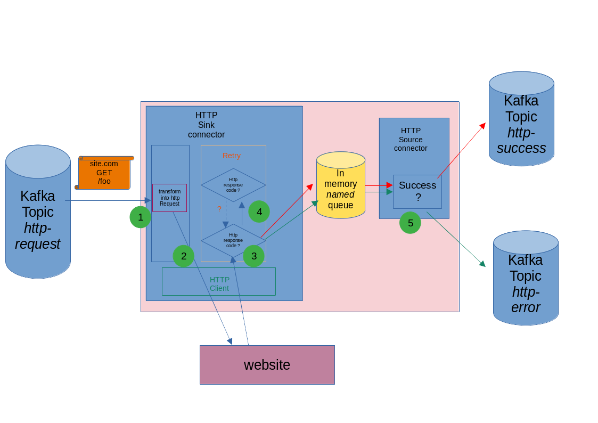

# request handling

According to this request Handling schema, here are the steps involved in request handling : 

1. we read the incoming message, and convert it to an HttpRequest Object.
2. we pass this _HttpRequest_ object to the HTTP client implementation, which execute the query
3. we create an HttpResponse object, representing the answer of the website. We wrap the request, response, and some metadata
(time elapsed...) as an _HttpExchange_ object. We use the _HttpResponse_ status code as an input of the 
`default.success.response.code.regex` settings. If it matches, we set the success boolean field from HttpExchange,
as true. the _HttpExchange_ is wrapped with some metadata from the incoming SinkRecord (keySchema,
key, and headers), and transmit it to the in memory queue. If it does not matches, we set the _HttpExchange_'s field '_success_'
to false, and publish the _HttpExchange_ to the **in memory queue**.
4. If the HttpExchange contains a _success_ field set to true, we don't trigger a retry. If the success field is set
to **false**, <u>and</u> the `default.retry.response.code.regex` matches the HttpResponse status code, we trigger a retry.
5. According to the HttpExchange success field, we put the HttpExchange in the success or error topic configured. We keep the
message key, and headers used in the incoming kafka message, in the outcoming message.